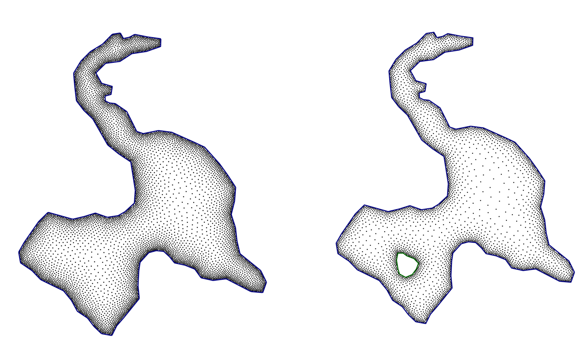

# CollocationPoints.jl

`CollocationPoints.jl` is a Julia package for generating collocation points inside various domains, with support for variable point density. The primary goal here is to use this for solving PDEs with physics-informed machine learning

## Features

- Generate uniformly distributed points in circles and rectangles.
- Generate points with variable density, concentrating points around specific points, lines, or boundaries.
- Define complex domains from boundary coordinates.
- Smooth boundary representations.





## Usage

Here is a basic example of how to generate and plot uniform collocation points in a circle:

```julia
using CollocationPoints
using CairoMakie # For plotting

# Define domain and parameters
box = [-1.0, 1.0, -1.0, 1.0]
hbdy = 0.02
ptol = 0.001
bdy, fd = draw_circ(0.0, 0.0, 1.0, 2 / hbdy)
ctps = zeros(0, 2) # No control points for uniform density
radius_fn(p, ctps) = fill(0.05, size(p, 1))

# Generate points
xy = CollocationPoints2D(fd, box, ctps, ptol, radius_fn)

# Plotting
fig = Figure(size = (600, 600))
ax = Axis(fig[1, 1], aspect = DataAspect())
hidedecorations!(ax)
scatter!(ax, xy[:, 1], xy[:, 2], color=:black, markersize=4)
lines!(ax, bdy[:, 1], bdy[:, 2], color=:blue, linewidth=2)
save("uniform_circle.png", fig)
```
This will produce an image `uniform_circle.png` with the generated points.

### Running Examples

The package includes a comprehensive set of examples in the `examples/` directory. To run them:

1.  Navigate to the `examples/` directory in your terminal.
2.  Start Julia: `julia`
3.  Activate the example environment and run the script:
    ```julia
    import Pkg
    Pkg.activate(".")
    Pkg.instantiate() # Installs dependencies like CairoMakie
    include("run_examples.jl")
    ```

This will generate a series of plots in the `examples/figures/` directory, showcasing the different capabilities of the package.

## Data Files for Demos

The examples for complex geometries (`L-shape`, `lake`, `island`) require data files that define the boundary coordinates. You need to place these files in the `examples/demos/` directory.

- `Lshape.txt`
- `lake.txt`
- `island.txt`

Each file should contain a list of x, y coordinates, one pair per line, separated by spaces.