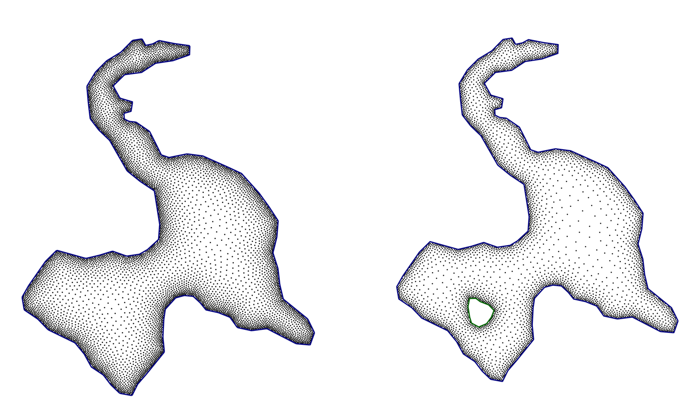
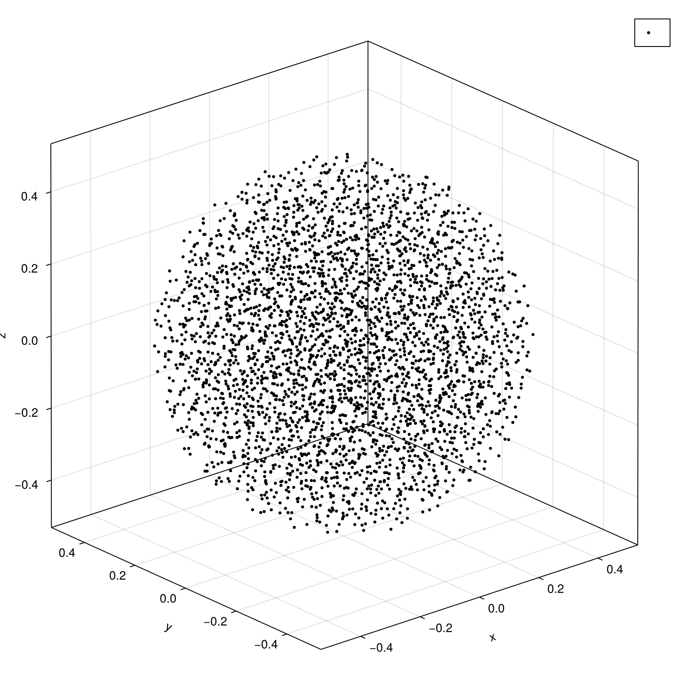

# CollocationPoints.jl

`CollocationPoints.jl` is a Julia package for generating collocation points inside various domains, with support for variable point density. The primary goal here is to use this for solving PDEs with physics-informed machine learning

 

## Features

- Generate uniformly distributed points in circles and rectangles.
- Generate points with variable density, concentrating points around specific points, lines, or boundaries.
- Define complex domains from boundary coordinates.
- Smooth boundary representations.

### Running Examples

The package includes a comprehensive set of examples in the `examples/` directory. To run them:

1.  From the main directory in your terminal.
2.  Start Julia: `julia --project=. example/run_2D.jl`

This will generate a series of plots in the `examples/figures/` directory, showcasing the different capabilities of the package.

## Data Files for Demos

The examples for complex geometries (`L-shape`, `lake`, `island`) require data files that define the boundary coordinates. You need to place these files in the `examples/demos/` directory.

- `Lshape.txt`
- `lake.txt`
- `island.txt`

Each file should contain a list of x, y coordinates, one pair per line, separated by spaces.

# Citations

- Mishra, Pankaj K (2019). NodeLab: A MATLAB package for meshfree node-generation and adaptive refinement. Journal of Open Source Software, 4(40), 1173, https://doi.org/10.21105/joss.01173
- Fornberg, B. and Flyer, N., 2015. Fast generation of 2-D node distributions for mesh-free PDE discretizations. Computers & Mathematics with Applications, 69(7), pp.531-544. 